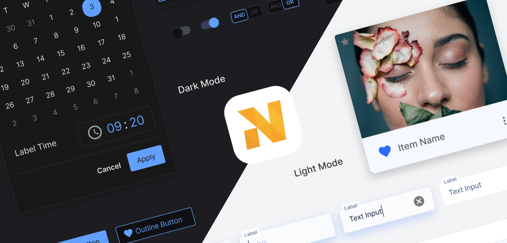

# Human Voice Rewrites
**Matching Edmond's actual writing style**

---

## ABOUT PAGE - In Your Voice

### Hero Section:

```html
<section class="about-section intro-section">
    <div class="about-heading">
        <h1>About Me</h1>
    </div>
    <div class="about-text intro-text">
        <p>I'm Edmond, Head of Design at Logifuture.</p>

        <p>For the past 15+ years I've been building design systems and leading teams across fintech, gaming, and SaaS. I focus on taking products from zero to one, while creating the foundations that help teams move faster and design with purpose at scale.</p>

        <p>My work has reached over 300,000 daily active users, and I've built design systems that organisations have been using for 7+ years.</p>

        <p>Some highlights from recent projects:</p>
        <ul style="line-height: 1.8;">
            <li>Led Simulate from 5k to 300k daily bets in 14 months. Peak was 320k bets in a day.</li>
            <li>Built the NovaHub design system with around 5,000 components. It's served 50+ users and is still going strong after 7 years.</li>
            <li>Led design as the sole designer supporting 6 developers across multiple product teams.</li>
            <li>Taken products from zero to one across mobile, web, and retail channels.</li>
        </ul>

        <p>I combine structure and creativity to help teams work efficiently, move quickly, and design with purpose at scale.</p>

        <h3 style="margin-top: 2rem; margin-bottom: 1rem;">Outside of Work</h3>
        <p>In my free time, I draw, take <a href="/pages/gallery/">photos</a>, and enjoy cooking.</p>

        <p>Self learning is an important part of my core values. One of the ways I like to keep updated is learning about human centered design, and design team workflows.</p>

        <p>Being part of a team, I bring my experiences as an innovator and leader to encourage creativity and communication.</p>
    </div>
</section>
```

---

## HOMEPAGE - In Your Voice

### Hero Section (lines 61-64):

```html
<div class="hero-description">
    <p>I lead cross-functional teams to create meaningful user experiences. With more than 15 years in both product and design, I focus on defining vision, reducing ambiguity, and establishing the framework for quick, targeted progress.</p>

    <p>Recent work includes building a design system with 5,000+ components that's been used for 7+ years, and leading Simulate from 5k to 300k daily bets in 14 months.</p>

    <p>I combine structure and creativity to help teams work efficiently, move quickly, and design with purpose at scale.</p>
</div>
```

### Project Cards - With Your Voice:

```html
<!-- Project 1 - NovaHub -->
<a href="/pages/projects/novahub/" class="project-card-link">
    <article class="project-card">
        <div class="project-content">
            <span class="project-company">Nova futur Ltd</span>
            <h3 class="project-title">NovaHub</h3>
            <p class="project-description">
                Built a SaaS design system with around 5,000 components serving 50+ users. It's been in active use for over 7 years, facilitating team work, transparency and preventing inconsistencies on a large scale backoffice.
            </p>
            <div class="project-tags">
                <span class="tag">#DesignSystem</span>
                <span class="tag">#MajorProject</span>
                <span class="tag">#7Years</span>
            </div>
        </div>
        <div class="project-image">
            
        </div>
    </article>
</a>

<div class="project-divider"></div>

<!-- Project 2 - Linking Products -->
<a href="/pages/projects/linking-products/" class="project-card-link">
    <article class="project-card">
        <div class="project-content">
            <span class="project-company">Nova futur Ltd</span>
            <h3 class="project-title">Linking Products</h3>
            <p class="project-description">
                Building links between products, to benefit users with efficient workflows. We eliminated the manual CSV download and upload process that was causing errors.
            </p>
            <div class="project-tags">
                <span class="tag">#DesignThinking</span>
                <span class="tag">#LinkingFlows</span>
                <span class="tag">#Teamwork</span>
            </div>
        </div>
        <div class="project-image">
            
        </div>
    </article>
</a>

<div class="project-divider"></div>

<!-- Project 3 - Simulate -->
<a href="/pages/projects/simulate/" class="project-card-link">
    <article class="project-card">
        <div class="project-content">
            <span class="project-company">Nova futur Ltd</span>
            <h3 class="project-title">Simulate</h3>
            <p class="project-description">
                Led design for a sports betting app that went from 5k to 300k daily bets in 14 months. Peak was 320k bets in a day across mobile and retail channels.
            </p>
            <div class="project-tags">
                <span class="tag">#IC</span>
                <span class="tag">#MVP</span>
                <span class="tag">#ProductDesign</span>
            </div>
        </div>
        <div class="project-image">
            
        </div>
    </article>
</a>
```

---

## META DESCRIPTIONS - In Your Voice

Keep these factual but less corporate:

```html
<!-- Homepage -->
<meta name="description" content="I'm Edmond Miu, Head of Design at Logifuture. 15+ years building design systems and leading teams. Built systems serving 50+ users for 7 years. Led products to 300k+ daily users.">

<!-- About Page -->
<meta name="description" content="About Edmond Miu, Head of Design at Logifuture. 15+ years experience in design systems, product leadership, and 0-1 development across fintech, gaming, and SaaS.">

<!-- Simulate -->
<meta name="description" content="Simulate case study: Led design from 5k to 300k daily bets in 14 months. Individual design contributor for branding, user flows, and developer support. Peak 320k bets/day.">

<!-- NovaHub -->
<meta name="description" content="NovaHub design system case study: Built around 5,000 components serving 50+ users for 7+ years. Led initiative as sole designer supporting 6 developers. Material UI and Figma.">

<!-- Linking Products -->
<meta name="description" content="Linking Products case study: Eliminated manual CSV workflows by designing integration flows between SaaS products. Reduced errors and improved efficiency through workshops and MVP scoping.">
```

---

## SCHEMA.ORG - Keep Technical

The Schema.org structured data should stay as-is because it's for machines, not humans. AI crawlers expect formal data structures. This is where you want metrics listed clearly:

- ✅ Keep Schema.org JSON-LD structured as I provided
- ✅ These are read by machines, not displayed to users
- ✅ This is where "Expert in" and formal titles are appropriate

---

## KEY DIFFERENCES:

### Your Voice ✅
- "I'm Edmond" (not "I'm Edmond Miu, Head of Design at...")
- "around 5,000 components" (not "5,000+ components")
- "It's been in active use for over 7 years" (not "7+ years in production")
- "Peak was 320k bets in a day" (not "Peak of 320k bets/day")
- "We eliminated the manual CSV download and upload process" (not "Eliminated manual CSV workflows")
- Uses "organisation" not "organization"
- Uses "realise" not "realize"
- Natural paragraph flow, not bullet points in body text

### Where to Be Formal ✅
- Meta descriptions (read by AI, needs clarity)
- Schema.org data (machine-readable)
- Page titles

### Where to Be You ✅
- All visible body text
- Project descriptions
- About page content
- Hero sections

---

## RECOMMENDED CHANGES TO AUDIT:

Use the rewrites above instead of my corporate versions for:
1. About page body text
2. Homepage hero description
3. Project card descriptions
4. Meta descriptions (slightly toned down)

Keep my original versions for:
1. Schema.org structured data (it's for machines)
2. Technical SEO fixes (broken links, sitemap)
3. Accessibility improvements

---

This way you get:
- ✅ AI-friendly structured data (machines)
- ✅ Your actual voice in content (humans)
- ✅ Best of both worlds
